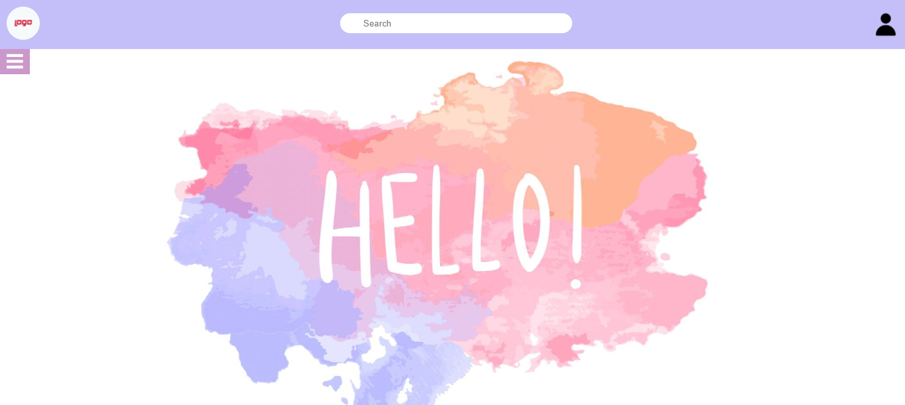
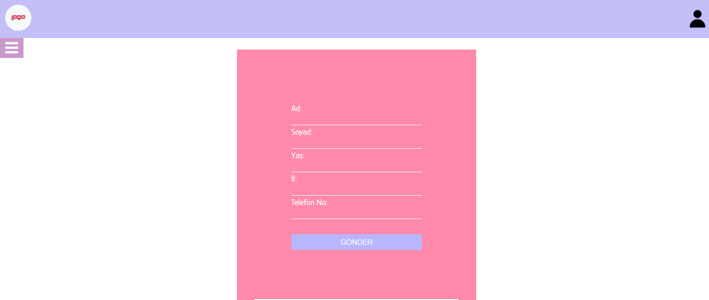
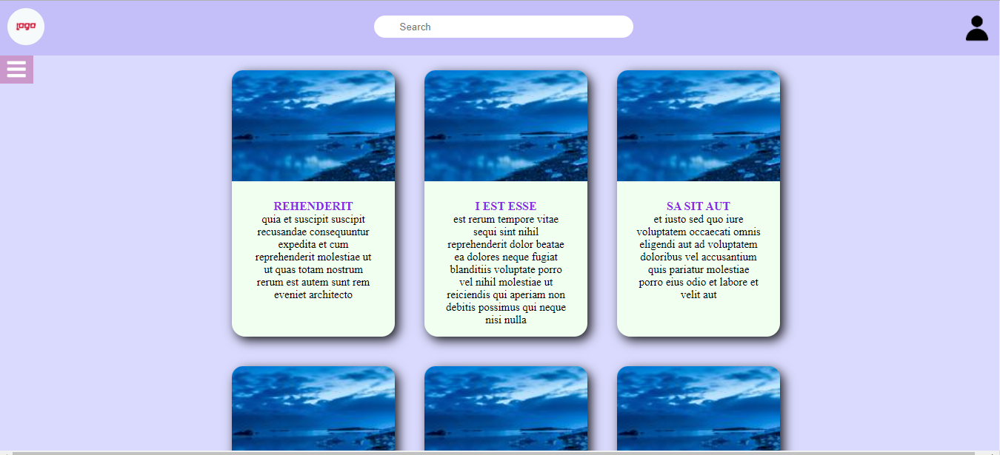

# Ciceksepeti-Odev-1

Bu proje Çiçeksepeti Bootcamp proğramının ilk projesidir. 

Projede Html, Css ve JavaScript kullanılmıştır. 

Css'de form ve card yapısı kullanıldı. Ayrıca card yapısında grid sistem kullanıldı. 

JavaScript'te Fetch ile Json formatında 10 adet veri çekildi ve bu veriler card yapısında gösterildi.

	

